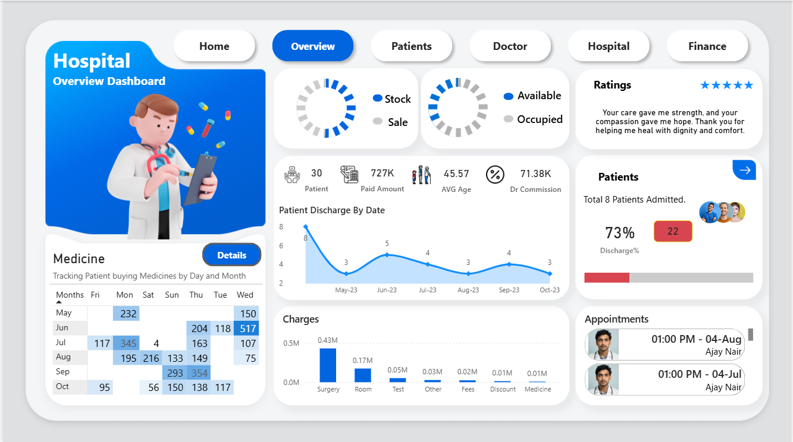

# 🏥 Hospital Analysis Dashboard: Operational & Financial Deep Dive (Power BI Project)

## 🌟 Executive Summary

This project showcases a comprehensive, end-to-end business intelligence solution for modern hospital management, developed entirely in Power BI. It transforms raw, static Excel data into a dynamic, interactive suite of dashboards covering key operational domains: **Patient Flow**, **Doctor Performance**, **Operational Charges**, and **Financial Health**.

The primary objective is to move beyond simple reporting by providing granular, cross-functional visibility that facilitates data-driven decision-making. The dashboard suite features five distinct pages, enabling hospital leadership to monitor daily operations and strategic long-term performance simultaneously.

---

## 💾 Data Source & Preparation

The analysis is powered by a structured dataset sourced from **Microsoft Excel**.

* **Source Files:** The data was ingested and modeled directly from Excel workbooks, representing various facets of hospital operations (e.g., Patient Records, Medicine Inventory, Doctor Salaries, and Billing Logs).
* **Data Preparation (Power Query):** The data underwent rigorous cleaning, transformation, and shaping within Power BI's Power Query Editor to ensure integrity, consistency, and optimal performance for visualization.
* **Data Modeling:** A robust star schema or similar relational model was established to link fact tables (e.g., Charges, Sales) with dimension tables (e.g., Patients, Doctors, Dates), enabling complex cross-filtering and accurate aggregation across all dashboard pages.

---

## 📸 Dashboard Screenshots

| Page | Description | Image Placeholder |
| :--- | :--- | :--- |
| **Front Page** | Project cover and navigation overview. | |
| **Overview Dashboard** | High-level summary of operational KPIs. | |

**[Overview Dashboard from Page 2]**

---

---

| **Patients Dashboard** | Detailed patient records and consumption patterns. | |
| **Doctors Dashboard** | Doctor-specific performance and commission tracking. | |
| **Finance Dashboard** | Comprehensive financial metrics and resource allocation. | |

---

## 📈 Key Performance Indicators (KPIs)

The dashboard provides instant visibility into critical organizational metrics:

| Metric | Value | Dashboard Page | Insight |
| :--- | :--- | :--- | :--- |
| **Total Patients** | 30 | Overview / Finance | Total patients monitored in the current period. |
| **Total Paid Amount** | 727K | Overview / Finance | Total revenue generated from patient payments. |
| **Average Age** | 45.57 | Overview / Finance | Supports demographic and service planning. |
| **Discharge Rate** | 73% | Overview | Reflects hospital efficiency and patient turnover. |
| **Dr. Commission** | 71.38K | Overview / Finance | Total commissions paid to all doctors. |
| **Doctor Salary Total** | 4M | Finance | Total doctor compensation expenditure. |
| **Staff Count** | 3,928 | Finance | Total non-medical staff population. |
| **Staff Salary Total** | 714K | Finance | Total expenditure on staff compensation. |

---

## 🔎 Detailed Visualizations Analysis

### 1. Overview Page Analysis (Page 2)

* **Patient Discharge By Date:** A line chart illustrating discharges from May–Oct 2023, revealing peak demand periods and resource allocation needs.
* **Charges Breakdown:** A column chart showing revenue distribution among Surgery, Room, Test, Fees, Discounts, and Medicine. **Surgery** is identified as the highest revenue generator.
* **Medicine Tracking Matrix:** A matrix outlining medicine purchases by month (May–Oct) and day of the week, supporting consumption and procurement analysis.

---

### 2. Patients Page Analysis (Page 3)

* **Patient Charges:** Breaks down individual patient charges by category (e.g., Surgery 25K, Room 10K, Test 5K).
* **Medicine Sale (QTY):** Ranks medicines purchased by the patient, with **Omeprazole** and **Paracetamol** as top items.
* **Patient Feedback:** Captures qualitative insights such as wait times and treatment satisfaction.

---

### 3. Doctor Page Analysis (Page 4)

* **Commission Rate:** Displays each doctor’s commission percentage (e.g., Dr. Aditya Gupta: 10%).
* **Patient Spend & Bills:** Shows patient billing totals, surgery status, fees, and financial contribution per doctor.

---

### 4. Finance Page Analysis (Page 6)

* **Medicines Stock Status:** Compares stock vs. sales for key medicines (Paracetamol, Ibuprofen, Omeprazole) to prevent shortages.
* **Supplier Analysis:** Highlights unit price variations across medical suppliers to support cost optimization.

---

## ✅ Future Enhancements

* **DAX Optimization:** Further refining complex DAX measures for quicker rendering and performance.
* **Security Integration:** Implementing Row-Level Security (RLS) to restrict data views based on the user's role (e.g., a doctor only sees their patient data).
* **Web Integration:** Publishing the dashboard to the Power BI Service for broader organizational access and mobile viewing.

---

## About Me
My name is Vaishnavi Sood, and I am currently pursuing B.Com from Delhi University with a growing interest in data analytics and business intelligence. I am actively building my skills through Power BI projects where I explore data modeling, DAX, interactive dashboards, and performance optimization. Working on these projects is helping me strengthen my foundation in data visualization, analytical thinking, and creating insights that support smart decision-making.
